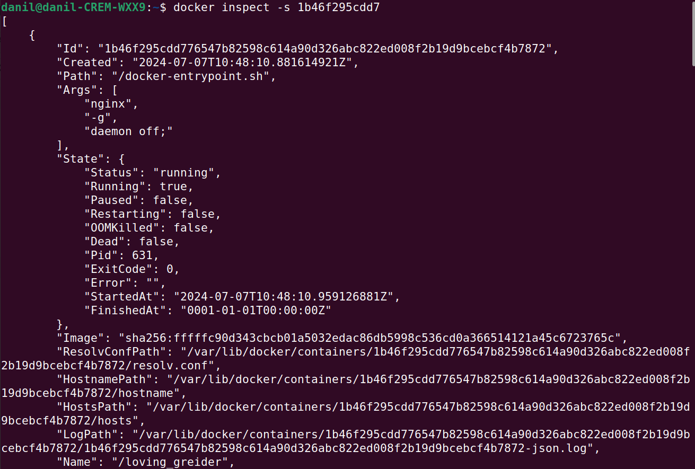
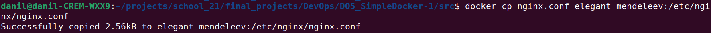
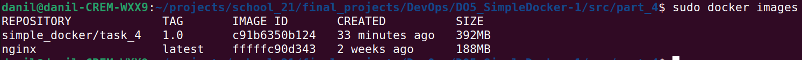
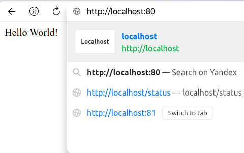

## Part 1. Готовый докер

Устанавливаем `Docker Desktop`: \


### 1.1. Возьми официальный докер-образ с nginx и выкачай его при помощи `docker pull`

Скачиваем образ nginx при помощи команды `sudo docker pull nginx`: \


### 1.2. Проверь наличие докер-образа через `docker images`

С помощью команды `sudo docker images` проверяем наличие docker-образа: \


### 1.3. Запусти докер-образ через docker run -d [image_id|repository]

Запускаем docker-образ командой `docker run -d nginx`: \


### 1.4. Проверь, что образ запустился через docker ps

Командой `docker ps` проверяем запущенный docker-образ: \


### 1.5. Посмотри информацию о контейнере через docker inspect [container_id|container_name]

Командой `docker inspect -s 1b46f295cdd7` просматриваем информацию о контейнере (флаг отвечает за вывод размера контейнера): \


### 1.6. По выводу команды определи и помести в отчёт размер контейнера, список замапленных портов и ip контейнера

Размер контейнера (общий размер и размер созданных или измененных файлов): \


Cписок замапленных портов (процесс связывания портов контейнера с портами хост-системы): \


Ip контейнера: \


### 1.7. Останови докер образ через docker stop [container_id|container_name]

Останавливаем docker-образ командой `docker stop loving_greider`: \


### 1.8. Проверь, что образ остановился через docker ps

Проверяем, остановлен ли docker-образ командой `docker ps`: \


### 1.9. Запусти докер с портами 80 и 443 в контейнере, замапленными на такие же порты на локальной машине, через команду run

С помощью команды `docker run -d -p 80:80 -p 443:443 nginx` запускаем докер с портами 80 и 443 в контейнере: \


### 1.10. Проверь, что в браузере по адресу localhost:80 доступна стартовая страница nginx

Проверяем подключение в браузере поисковым запросом `localhost:80`: \
 \


### 1.11. Перезапусти докер контейнер через docker restart [container_id|container_name]

Используем команду `docker restart elegant_mendeleev` для перезапуска docker-образа: \


### 1.12. Проверь любым способом, что контейнер запустился

Используем `docker ps` для проверки перезапуска: \


## Part 2. Операции с контейнером

### 2.1. Прочитай конфигурационный файл nginx.conf внутри докер контейнера через команду exec

Открывам конфиг с помощью команды `docker exec elegant_mendeleev cat /etc/nginx/nginx.conf`: \


### 2.2. Создай на локальной машине файл nginx.conf

Создаем файл в директории проекта командой `touch nginx.conf`: \


### 2.3. Настрой в нем по пути /status отдачу страницы статуса сервера nginx

Открываем файл для редактирования командой `nano nginx.conf`, копируем в него строки, полученные в пункте 2.1., но комментируем последнюю строку с подключением других конфигов и дописываем необходимые строки: \


```
user  nginx;
worker_processes  auto;

error_log  /var/log/nginx/error.log notice;
pid        /var/run/nginx.pid;


events {
    worker_connections  1024;
}


http {
    include       /etc/nginx/mime.types;
    default_type  application/octet-stream;

    log_format  main  '$remote_addr - $remote_user [$time_local] "$request" '
                      '$status $body_bytes_sent "$http_referer" '
                      '"$http_user_agent" "$http_x_forwarded_for"';

    access_log  /var/log/nginx/access.log  main;

    sendfile        on;
    #tcp_nopush     on;

    keepalive_timeout  65;

    #gzip  on;

    #include /etc/nginx/conf.d/*.conf;
    
    server {
        listen 80;
        
        location /status {
             stub_status on;
        }
    }
}
```

### 2.4. Скопируй созданный файл nginx.conf внутрь докер-образа через команду docker cp

Копируем файл внутрь докер-образа командой `docker cp nginx.conf elegant_mendeleev:/etc/nginx/nginx.conf`: \



### 2.5. Перезапусти nginx внутри докер-образа через команду exec

Перезапускаем конфиг командой `docker exec elegant_mendeleev nginx -s reload`: \


### 2.6. Проверь, что по адресу localhost:80/status отдается страничка со статусом сервера nginx

Проверяем открытие странички со статусом сервера поисковым запросом `localhost:80/status`: \
 \


### 2.7. Экспортируй контейнер в файл container.tar через команду export

**Имя докер-образа поменялось, так как продолжаю на следующий день.**

Используя команду `docker export determined_chaplygin > container.tar` экспортирую контейнер в файл: \


### 2.8. Останови контейнер

Останваливаем контейнер командой `docker stop determined_chaplygin`: \


### 2.9. Удали образ через docker rmi [image_id|repository], не удаляя перед этим контейнеры

Удаляем образ командой `docker rmi -f nginx`: \


### 2.10. Удали остановленный контейнер

Удаляем остановленный контейнер командой `docker rm determined_chaplygin`: \


### 2.11. Импортируй контейнер обратно через команду import

Импортируем контейнер обратно командой `docker import -c 'cmd ["nginx", "-g", "daemon off;"]' -c 'ENTRYPOINT ["/docker-entrypoint.sh"]' container.tar nginx`: \


### 2.12. Запусти импортированный контейнер

Запускаем контейнер командой `docker run -d -p 80:80 -p 443:443 13cc71d3e203`: \


### 2.13. Проверь, что по адресу localhost:80/status отдается страничка со статусом сервера nginx

Проверяем отдачу страницы по адресу localhost:80/status: \
 \


## Part 3. Мини веб-сервер

### 3.1. Напиши мини-сервер на C и FastCgi, который будет возвращать простейшую страничку с надписью "Hello World!"

Устанавливаем необходимые утилиты командой `sudo apt install libfcgi-dev libfcgi0ldbl spawn-fcgi`.

Создаем `.c`-файл и пишем код, выводящий "Hello World!" при поступлении HTTP-запроса:
```
#include <fcgi_stdio.h>
#include <stdio.h>

int main(void) {
	while(FCGI_Accept() >= 0) {
		printf("Content-type: text/html\r\n\r\nHello World!\r\n\r\n");
	}
	return 0;
}
```

Также создаем Makefile для компиляции получившегося сервера:
```
CC = gcc
CFLAGS = -Wall -Werror -Wextra
LIBS = -lfcgi

TARGET = server
SRC_FILES = $(TARGET).c
OBJ_FILES = $(SRC_FILES:.c=.o)

all: build

build: $(OBJ_FILES)
	$(CC) $(CFLAGS) $< -o $(TARGET) $(LIBS)

$(OBJ_FILES): $(SRC_FILES)
	$(CC) $(CFLAGS) -c $< -o $@ $(LIBS)

clean:
	rm $(TARGET) *.o

rebuild: clean build

.PHONY: all build clean rebuild
```

### 3.2. Напиши свой nginx.conf, который будет проксировать все запросы с 81 порта на 127.0.0.1:8080

Создаем nginx.conf в папке nginx и пишем строки, необходимые для проксирования всех запросов с 81 порта на 127.0.0.1:8080:
```
user nginx;
worker_processes auto;

error_log  /var/log/nginx/error.log notice;
pid        /var/run/nginx.pid;


events {
    worker_connections 1024;
}

http {

    include      /etc/nginx/mime.types;
    default_type application/octet-stream;

    log_format  main  '$remote_addr - $remote_user [$time_local] "$request" '
                      '$status $body_bytes_sent "$http_referer" '
                      '"$http_user_agent" "$http_x_forwarded_for"';

    access_log  /var/log/nginx/access.log  main;
    sendfile on;
    keepalive_timeout 65;

    server {
        listen 81;
        server_name localhost;
        location / {
            fastcgi_pass 127.0.0.1:8080;
        }
    }

}
```

### 3.3. Проверь, что в браузере по localhost:81 отдается написанная тобой страничка

Запускаем nginx командой `sudo docker run -d -p 81:81 --name task_3 nginx`: \


Копируем сервер и конфиг в контейнер командами `sudo docker cp nginx.conf task_3:/etc/nginx/` и `sudo docker cp server/ task_3:/home/`: \


Запускаем внутри контейнера интерактивную оболочку командой `sudo docker exec -it task_3 bash`: \


Устанавливаем на контейнер необходимые пакеты командами `apt update` и `apt install gcc make spawn-fcgi libfcgi-dev`.

Собираем сервер командой `make`: \


Запускаем сервер командой `spawn-fcgi -p 8080 ./server`: \


Перезапускаем nginx в контейнере командой `nginx -s reload` и выходим из интерактивной оболочки командой `exit`.

Проверяем статус сервера в браузере: \


### 3.4. Положи файл nginx.conf по пути ./nginx/nginx.conf (это понадобится позже)

Сделал в начале данной части.


## Part 4. Свой докер

### 4.1. Напиши свой докер-образ, который:

**1) собирает исходники мини сервера на FastCgi из Части 3;**

**2) запускает его на 8080 порту;**

**3) копирует внутрь образа написанный ./nginx/nginx.conf;**

**4) запускает nginx. (nginx можно установить внутрь докера самостоятельно, а можно воспользоваться готовым образом с nginx'ом, как базовым).**

Пишем docker-образ, удовлетворяющий условиям выше:
```
FROM nginx:latest

# Установка пакетов
RUN apt-get update && \
    apt-get install -y gcc make spawn-fcgi libfcgi-dev nginx

# Копирование исходников сервера
COPY ./server /home/server

# Копирование конфига nginx
COPY ./nginx/nginx.conf /etc/nginx/nginx.conf

# Сборка сервера
RUN cd /home/server && \
    make all

# Запуск сервера и nginx
CMD ["sh", "-c", "spawn-fcgi -p 8080 /home/server/server && nginx -g 'daemon off;'"]
```

### 4.2. Собери написанный докер-образ через docker build при этом указав имя и тег

Пишем bash-скрипт для создания контейнера:
```
#!/bin/bash

# Удаление существующего образа и пересборка с помощью Dockerfile
sudo docker rmi -f simple_docker/task_4:1.0 && sudo docker build . -t simple_docker/task_4:1.0
```

Запускаем этот скрипт: \


### 4.3. Проверь через docker images, что все собралось корректно

Командой `sudo docker images` проверяем, создан ли контейнер: \


### 4.4. Запусти собранный докер-образ с маппингом 81 порта на 80 на локальной машине и маппингом папки ./nginx внутрь контейнера по адресу, где лежат конфигурационные файлы nginx'а (см. Часть 2)

Пишем bash-скрипт для запуска контейнера с необходимым маппингом:
```
#!/bin/bash

sudo docker run -d -p 80:81 -v ./nginx/nginx.conf:/etc/nginx/nginx.conf simple_docker/task_4:1.0
```

Запускаем этот скрипт: \


### 4.5. Проверь, что по localhost:80 доступна страничка написанного мини сервера

Проверяем статус сервера в браузере: \


### 4.6. Допиши в ./nginx/nginx.conf проксирование странички /status, по которой надо отдавать статус сервера nginx

Дописываем в конфиг необходимые строки для проксирования странички:
```
location /status {
		stub_status;
}
```

### 4.7. Перезапусти докер-образ

Перезапускаем docker-образ командой `sudo docker exec heuristic_clarke nginx -s reload`: \


### 4.8. Проверь, что теперь по localhost:80/status отдается страничка со статусом nginx

Проверяем статус сервера в браузере: \


## Part 5. Dockle

### 5.1. Просканируй образ из предыдущего задания через dockle [image_id|repository]

Сканируем образ командой `sudo dockle simple_docker/task_4:1.0`: \
 \


### 5.2. Исправь образ так, чтобы при проверке через dockle не было ошибок и предупреждений

Команда вывела данные предупреждения:
- Не храните учетные данные в переменных/файлах окружения;
- Очистить кэши apt-get;
- Создайте пользователя для контейнера;
- Включить доверие к контенту для Docker;
- Добавьте инструкцию по проверке работоспособности к изображению контейнера;
- Подтвердите безопасность файлов setuid/setgid.

Исправляем docker-файл:
```
FROM ubuntu:20.04

# Установка необходимых пакетов и очистка кэша apt
RUN apt-get update && \
    apt-get install -y gcc make spawn-fcgi libfcgi-dev nginx curl && \
    rm -rf /var/lib/apt/lists/*

# Копирование исходников сервера
COPY ./server /home/server

# Копирование конфига nginx
COPY ./nginx/nginx.conf /etc/nginx/nginx.conf

# Сборка сервера
RUN cd /home/server && \
    make all

RUN chmod 755 \
    /usr/bin/passwd \
    /usr/bin/mount \
    /usr/bin/umount \
    /usr/sbin/unix_chkpwd \
    /usr/bin/gpasswd \
    /usr/sbin/pam_extrausers_chkpwd \
    /usr/bin/chfn \
    /usr/bin/chsh \
    /usr/bin/newgrp \
    /usr/bin/su \
    /usr/bin/chage \
    usr/bin/expiry

RUN useradd -ms /bin/bash collenep \
    && chown -R collenep:collenep /usr/bin \
    && chown -R collenep:collenep /usr/sbin \
    && chown -R collenep:collenep /var \
    && chown -R collenep:collenep /run

# Смена пользователя на nginx
USER collenep

# Запуск сервера и nginx
CMD ["sh", "-c", "spawn-fcgi -p 8080 /home/server/server && nginx -g 'daemon off;'"]

HEALTHCHECK --interval=5m --timeout=3s \
  CMD curl -f http://localhost:80 || exit 1
```

Исправляем скрипт:
```
#!/bin/bash
export DOCKER_CONTENT_TRUST=1
echo "Start building containers..."

sudo docker rmi simple_docker/task_5:1.0 -f && sudo docker build . -t simple_docker/task_5:1.0
sleep 1
echo "Dockle check..."
sudo env DOCKER_CONTENT_TRUST=1 dockle simple_docker/task_5:1.0
```

Собираем докер-образ и проверяем корректность dockle: \


Запускаем докер-образ с помощью скрипта, написанного в предыдущей части: \


Проверяем статус сервера в браузере: \


